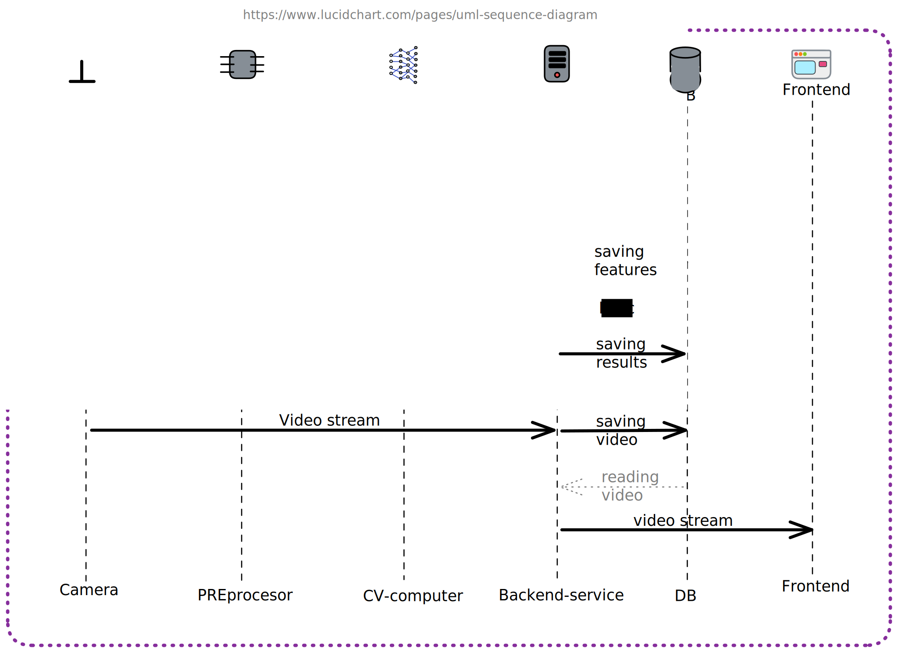

# Техническое задание по проекту "Создание системы видеонаблюдения на базе одноплатных компьютеров"

## Общие сведения

### 1. Цель проекта

Изучить одноплатные компьютеры и способы 
взаимодействия с ними и реализовать пакет 
программного обеспечения для распознавания людей на 
видео для микрокомпьютера (в частности для подсчета 
людей в помещении)

### 2. Команда исполнителей
- Беляков Дмитрий
- Кривошеев Андрей
- Смирнов Виктор
- Тюрин Иван

## Технические требования

- Расписать пайплайн
- Какая нейросеть
- Какие инструменты разработки
- Способ оценивания

- В следующий раз работаем с оборудованием
- На плате можно развернуть сервис

### 1. Требования к функциональным характеристикам

Клиент способен просматривать в режиме “реального 
времени” видеоизображение, а также просматривать 
статистику за определенный период времени по 
количеству людей в помещении.

Система состоит из следующих частей: 
- Видеокамера
- Плата Jetson Nano
- Бэкэнд
  - Сервис сбора и обработки
  - Сервис хранения данных
- Клиент
  - Веб-Сайт

Камера передает поток видео по проводу на плату 
Jetson Nano.

Плата Jetson Nano будет принимать данные с камеры, 
обрабатывать их и передавать поток оригинального 
видео и выходные данные на Бэкенд.

Бэкенд будет принимать информацию с платы, считать 
статистики (coхранять в БД), и по запросу отдавать
агрегированные данные пользователю, а также
предоставлять ему поток оригинального видео
с камеры.

На Клиенте можно будет смотреть статистику по 
количеству человек в помещении в конкретный момент 
времени (быть может в виде таблицы), а также 
просматривать видеопоток.

### 2. Требования к надежности

#### Время работы

- Система должна функционировать 80% времени;
- Система должна работать с 8:00 до 20:00 
  в будние дни и с 11:30 до 18:30 по выходным;
- Допустимы перебои на 20-30 минут.

#### Производительность

- Актуальность видео стрима - минута
- Время ответа до 5 секунд
- Количество одновременно работающих пользователей: 5

#### Точность

- Минимум 80% записей о количестве людей в комнате 
  точны

### 3. Условия эксплуатации

- Камера и Jetson Nano находятся в помещении 
  защищенном от влаги и пыли

- Камера не должна быть подвержена физическому   
  воздействию (не бить)

- Камера и Jetson Nano желательно должны быть 
  подключены к сети безперебойного питания

- Jetson Nano подключено к локальной сети

- Если что-то вышло из строя писать нам в ЛС

### 4. Требования к составу и параметрам технических средств

Характеристики частей:
- Камера (30 FPS, 1280 x 720)
- Плата Jetson Nano (\*вставить параметры\*)

### 5. Требования к информационной и программной совместимости

??? 

### 6. Требования к транспортированию и хранению

#### Безопасность

- Федеральный закон от 27.07.2006 No 149-ФЗ "Об 
  информации, информационных технологиях и о 
  защите информации"

## Требования к документации

- Описание алгоритмов основных и ссылки на источники

- Высокоуровневое описание процессов в системе

- Тикеты и ПРы в гитлабе

- Инструкции по сборке, установке и эксплуатации

## Технико-экономические показатели

??? 

В разделе должны быть указаны: ориентировочная стоимость 
единичного и серийного выпуска продукта, экономические 
преимущества разработки по сравнению с лучшими отечественными 
и зарубежными образцами или аналогами.

## Cтадии и этапы разработки

По неделям:

- 2 - 4:
  Установка технического задания и согласование проекта

- 5 - 8:
  Проектирование архитектуры, выбор инструментов разработки
  
- 9 - 12:
  Прототипирование, создание MVP
  
- 13 - 18:
  Реализация

## Порядок контроля и приемки

??? В разделе должны быть указаны виды испытаний и общие требования к 
приемке работы.

## Ссылки на источники

1. ГОСТ 19.201-78 Техническое задание. 
   Требования к содержанию и оформлению

